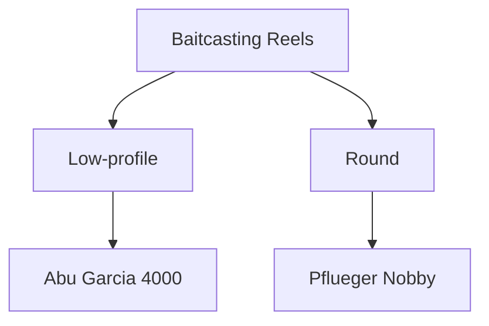

# Baitcasting Reels

Overview of baitcasting reels, their history, and how they work.

The two main types of baitcasting reels are round and low-profile, but there are also several design variation on these two basic types, like anti-backlash and star drag. Round baitcasting reels are the older design. Low-profile baitcasting reels are a more modern design. This diagram shows the various types of baitcasting reels and their relationships.

## Baitcasting Reels with Examples

**Pfleuger:** The Nobby.

**South Bend:** The 550.

**Abu Garcia:** The 2000--6000 series. Not strictly an American company, but important enough to mention in the world of baitcasting.