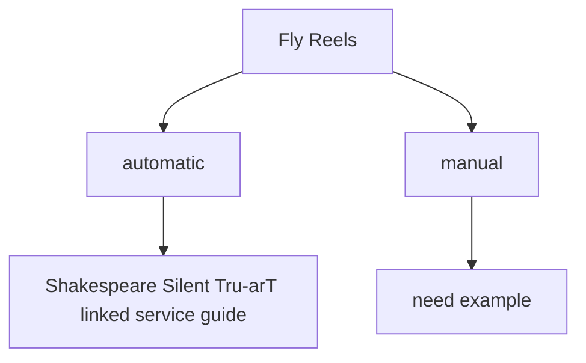

# Fly Reels

The two main types of fly reels are manual and automatic, but there are also several variation on these basic designs. Manual fly reels are, at their most basic, a simple spool. Automatic fly reels contain a spring, like a very large watch spring, which retrieves the line. This diagram shows the various types of fly reels and their relationships.

## Fly Reels with Examples

**Shakespeare:** The Silent Tru-arT automatic fly reel.
