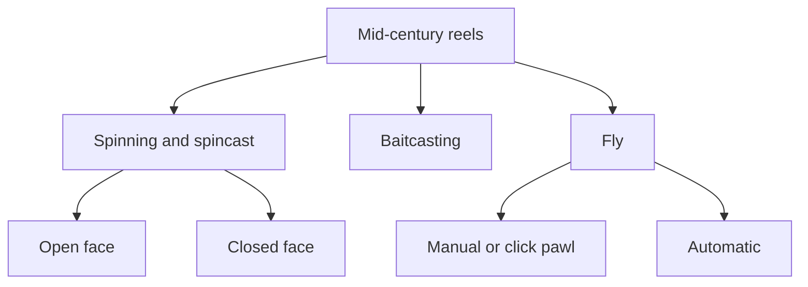

# A Family Tree of Mid-Century Reels

This family tree of reels shows the relationships between different types of reels and how they fit into groups based on shared characteristics. For each branch we have one or two examples, which are chosen on the basis of how well and simply they represent that sub-type. For instance, the Penn 720 is shown as a good example of the open-face, full-bail spinning reel since it is one of the cleanest and simplest examples of this design, as well as being a very successful and well-known model. The more oddball open-face finger pick-up design is represented by one of the more well-known of the relatively few models that were made, the Ocean City 350 Spin-A-Long.

Reels that represent hybrid designs, which don't fit easily into the categories here, are not included but may be included in future additions to this pages' content.

You can easily see where any reel you encounter fits into this chart by reading the background page on that reel type, for example, the [Fly Reels page](fly-reels.md). These pages also provide more background on the designs and how they work for the angler in the field.

Creative designers came up with a few more variations on the spinning and spincast reels than for baitcasting or fly reels, so for more details on those variations see the [Spinning and Spincast Reels page](spinning-reels.md).

[References](references.md)