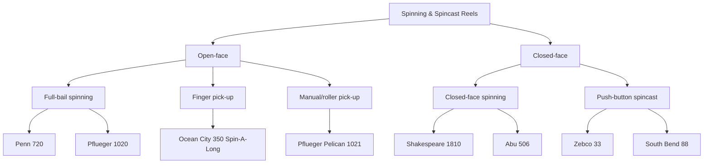

# A Taxonomy of Reels

```mermaid
flowchart TD
  A[Spinning & Spincast Reels]
  A --> B[Open-face]
  A --> C[Closed-face]

  B --> B1[Full-bail spinning]
  B --> B2[Finger pick-up]
  B --> B3[Manual/roller pick-up]

  C --> C1[Closed-face spinning]
  C --> C2[Push-button spincast]

  B1 --> D1[Penn 720]
  B1 --> D2[Pflueger 1020]

  B2 --> E1[Ocean City 350 Spin-A-Long]

  B3 --> F1[Pflueger Pelican 1021]

  C1 --> G1[Shakespeare 1810]
  C1 --> G2[Abu 506]

  C2 --> H1[Zebco 33]
  C2 --> H2[South Bend 88]
```