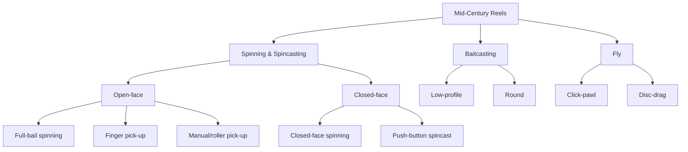
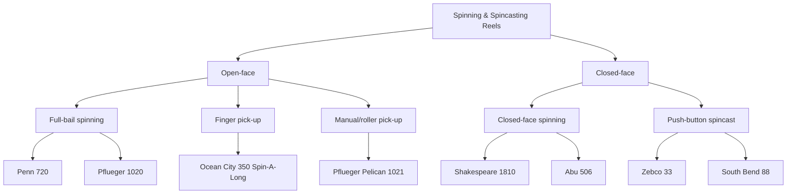
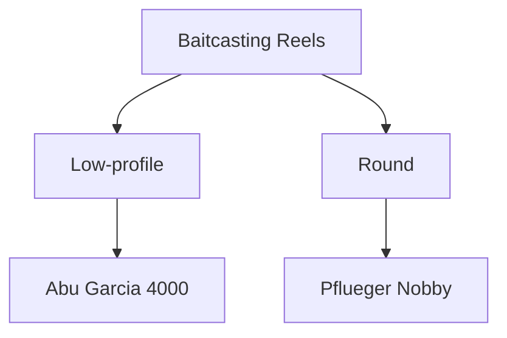
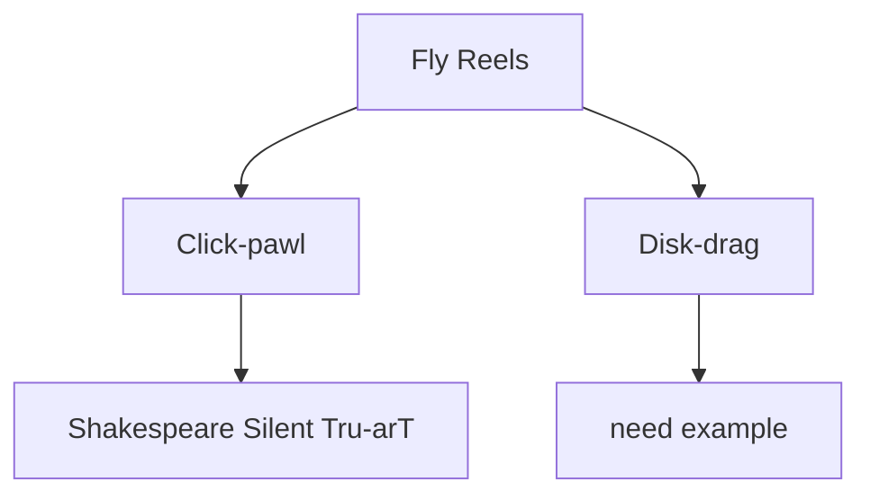

# A Taxonomy of Mid-Century Reels

A taxonomy is like a family tree. It helps you understand the relationships between different things, how they fit into groups based on shared characteristics. This page includes taxonomies for each of the four main typse of reels. For each sub-type we have one or two of what we call "pure" examples, which are chosen on the basis of how well and simply they represent that sub-type. For instance, the Penn 720 is shown as a good example of the open-face, full-bail spinning reel since it is one of the cleanest and simplest examples of this design, as well as being a very successful and well-known model. The more oddball open-face finger pick-up design is represented by one of the more well-known of the relatively few models that were made, the Ocean City 350 Spin-A-Long.

Reels that represent hybrid designs, which don't fit easily into the categories here, are not included but may be included in future additions to this pages' content.

You can easily see where any reel you encounter fits into this chart by reading the background page on that reel type (like the [Spinning Reels page](spinning-reels.md).

## All Mid-Century Reel Types

## Spinning and Spincasting Reels with Examples

## Baitcasting Reels with Examples

## Fly Reels with Examples

