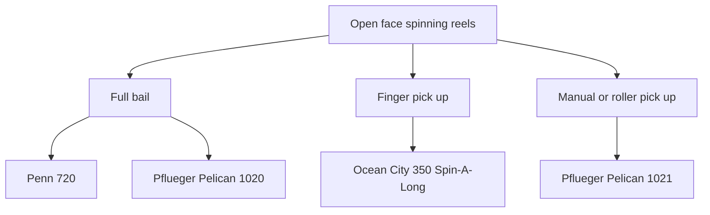
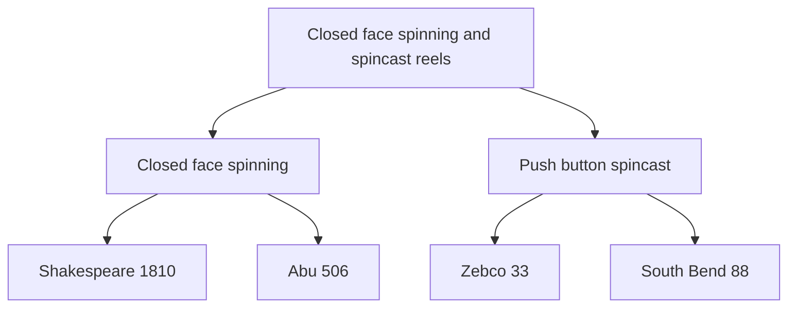

# Spinning and Spincast Reels

Overview of spinning and spincast reels, their history, and how they work.

The basic principle of the spinning reel is that the spool is stationary when casting--it doesn't revolve like the spool on a baitcasting reel. The spool only rotates when a fish takes out line. There are several technical advantages to the stationary-when-casting spool: backlash, which is part of the challenge of baitcasting, is eliminated; it also is easier to make longer casts with lighter lures. Overall spinning began to exceed more traditional baitcasting in popularity beacuse it is simply easier to learn.

While spinning has several advantages over more traditional bait-casting there are still significant technical advantages to baitcasting: big fish, heavier lures, and underwater snags are all easier to handle, greater casting accuracy is possible (which depends on the angler developing his or her skill).

Spincast reels are also called "push-button" reels.

## Features

## Important Manufacturers and Models

Penn, Pflueger, Zebco.

## Types

Spinning reels definitely have the most varied basic mechanisms. The two main types of spinning reels are open-face and closed-face, but there are also several (mostly oddball) variation on the open-face design, all of which not only have different basic mechanics, but also require the angler to develop different skills in line- and reel-handling. Closed-face spinning reels are closely related by design to spincast (sometimes called "push-button") reels. Each of these reel types is described in the following sections.

**Open-face spinning reels:** There are several different types of open-face spinning reels, which vary mostly in how they handle the line for casting and retrieving. The following chart shows the basic types.

Each of these types is described in a bit more detail in the following sections.

- **Full-bail:** The most common design. One notable example is the [Pfleuger Pelican 1020](pflueger/pflueger-pelican-service-guide.md). The mid-century Pelican is a has a full bail. It was Pfleuger's top-of-the-line spinning reel of that time, with a unique rear drag system. Another American maker of this period, Penn, produced a range of open-face spinning reels, [The Penn Spinfisher Series](../penn-spinfisher-series.md), which includes eight different models from ultralight to heavy duty.

- **Roller pick-up:** The finger pick-up style was considered a bit of an oddball design and never became very popular. An iconic example of this type is the [Pfleuger Pelican 1021](pflueger/pflueger-pelican-1021-service-guide.md), marketed as a reel for the more expert or advanced angler. Instead of a full wire bail the manual roller pick-up mechanism is engaged by hand.

- **Finger pick-up:** Like the roller pick-up, the finger pick-up style was considered an odd design, probably even more so than the roller pick-up style. Classic mid-century American model is the Ocean City 350 Spin-A-Long, produced in the mid-1950s when spinning reels were relatively new to the U.S. market. 
While this site focuses primarily on mid-century American-made reels, there were a few European makers that merit inclusion in the overall picture of how reel designs  evolved during this time period. One of these was the Swiss maker Monti, who made the Super spinning reel, also a finger pick-up design; one feature that marks it as a more evolved design is an adjustable drag nut.

**Closed-face spinning reels and spincast reels:** All push-button reels are closed-face, but not all closed-face reels are push-button! Closed-face spinning reels--which were a bit of an oddball design, never very popular--are easily confused with the very popular spincast or "push-button" reels. Spincast reels have a button for controlling the clutch and line release, like the classic [Zebco 33](zebco/zebco-33-service-guide.md), which is still in production today with a lot of internal changes. The Shakespeare 1810 series is a good example of a closed-face spinning reel. The Swedish-made Abu 506 is a bit more evolved version of the same design. The following chart shows the basic types of closed-face reels.

## Balanced Tackle

This section shows how you can fit any spinning or spincast reel into a balanced tackle outfit. If you are starting from the "collector" end and want to first choose a specific reel you can use this table to determine what rod to pair it up with and what line weights and lure weights will result in the best casting action.

If you are starting from the "angler" end and want to focus on a specific fish or fishing method (like trolling), you can research the reels to determine which will work best for the fish you are after and go from there. For example, if you wanted to primarily fish for smaller bass with a spinning reel you would use 4 to 8 lb. test line and so would be looking for a reel that performed best with 4 to 8 lb. test.

### Spinning Reels

Type of Fishing | Reel | Rod | Line lb. Test | Lures oz.
----------------|--------------|-------------|----------------|---------------
bass sunfish | light | extra-light light 6'--7' | 2--6 | 1/8--3/8
bass rainbow trout grayling | medium-light | light 6'6"--7' | 4--8 | 1/4--1/2
big bass snook walleye | medium | medium 6'6"--7' | 6--10 | 3/8--3/4
muskie tarpon salmon bonefish | medium-heavy | saltwater class 7'--8'6" | 10--15 | 1/2--1
saltwater: - surf -boat | heavy | saltwater class 9'--10'6" | 12--20 | 1--4

### Spincast (Push-Button) Reels

Type of Fishing | Reel | Rod | Line lb. Test | Lures oz.
----------------|--------------|-------------|----------------|---------------
bass sporty casting | light | extra-light 6'--7' | 4--6 | 1/4 best 1/8--1/2 good
big bass muskie freshwater trolling | medium | light 6'6"--7' | 8--12 | 3/8 best 1/4--5/8 good
snook salmon saltwater casting | medium-heavy | medium 6'--6'6" | 12--20 | 5/8 best 3/8--1 good

You can determine what line weights work well with a given reel by researching that reel on sites like [ORCA](https://www.orcaonline.org/) or using an AI-assisted web search, for example, [Perplexity](https://www.perplexity.ai/)--you want to locate the original package insert, user manual, or schematic. If you were considering a Penn 720, you would find that it does indeed handle 2 to 10 lb line, so it would not only work for small bass but would be a nice light outfit for panfish as well--a good example of the versatility of that reel.

Spinning reels are made in a wide enough range of sizes so that whatever species of fish you are after, there is a spinning reel that can handle it. In Penn's Spinfisher series alone, for example, there are reels like the 720 that can handle line weights down to 2 lbs. all the way up to the mighty 704, which can handle line weights up to 30 lbs. and cast 4 1/2 oz. lures!

Remember with balanced tackle outfits the main consideration is the lure weight--what you are going to be *casting* determines what rod, reel, and line will work best. And backing up a bit more to actual field conditions, what species and size fish you are after determines what lures you will be using.

[References](references.md)