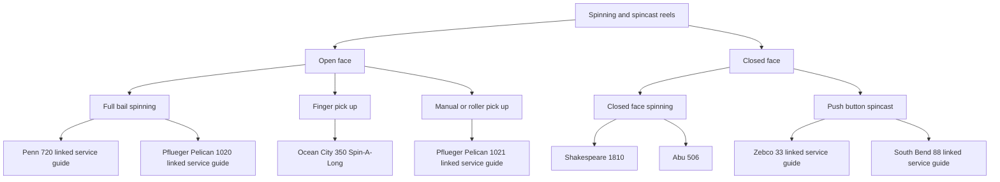

# Spinning Reels

Overview of spinning reels.

## How They Work

The basic principle of the spinning reel is that the spool is stationary when casting--it doesn't revolve like the spool on, for example, a baitcasting reel. The spool only rotates when a fish takes out line. There are several technical advantages to the stationary-when-casting spool: backlash, which is part of the challenge of baitcasting, is eliminated; it also is easier to make longer casts with lighter lures. Overall spinning began to exceed more traditional baitcasting in popularity beacuse it is simply easier to learn.

While spinning has several advantages over more traditional bait-casting there are still significant technical advantages to baitcasting: big fish, heavier lures, and underwater snags are all easier to handle, greater casting accuracy is possible (which depends on the angler developing his or her skill).

## Types

Spinning reels definitely have the most varied basic mechanisms. The two main types of spinning reels are open-face and closed-face, but there are also several (mostly oddball) variation on the open-face design, all of which not only have different basic mechanics, but also require the angler to develop different skills in line- and reel-handling. Closed-face spinning reels are closely related by design to spincast (sometimes called "push-button") reels.
Each of these reel types is described in the following sections.

**Open-face:** There are several different typs of open-face spinning reels:

- **Full-bail:** The most common design. One notable example is the [Pfleuger Pelican 1020](pflueger/pflueger-pelican-service-guide.md). The mid-century Pelican is a has a full bail. It was Pfleuger's top-of-the-line spinning reel of that time, with a unique rear drag system.

Another American maker of this period, Penn, produced a range of open-face spinning reels, [The Penn Spinfisher Series](../penn-spinfisher-series.md), which includes eight different models from ultralight to heavy duty.

- **Roller pick-up:** The finger pick-up style was considered a bit of an oddball design and never became very popular. An iconic example of this type is the [Pfleuger Pelican 1021](pflueger/pflueger-pelican-1021-service-guide.md), marketed as a reel for the more expert or advanced angler. Instead of a full wire bail the manual roller pick-up mechanism is engaged by hand.

- **Finger pick-up:** Like the roller pick-up, the finger pick-up style was considered an odd design, probably even more so than the roller pick-up style. Classic mid-century American model is the Ocean City 350 Spin-A-Long, produced in the mid-1950s when spinning reels were relatively new to the U.S. market.

While this site focuses primarily on mid-century American-made reels, there were a few European makers that merit inclusion in the overall picture of how reel designs  evolved during this time period. One of these was the Swiss maker Monti, who made the Super spinning reel, also a finger pick-up design; one feature that marks it as a more evolved design is an adjustable drag nut.

**Closed-face:** This type of spinning reel is easily confused with reels more correctly referred to as spincast or "push-button" reels. All push-button reels are closed-face, but not all closed-face reels are push-button. True closed-face spinning reels do not have a button for controlling the clutch and line release, like the classic [Zebco 33](zebco/zebco-33-service-guide.md), which is still in production today, with a lot of internal changes. The Shakespeare 1810 series is a good pure example of a closed-face spinning reel. The Swedish-made Abu 506 is a bit more evolved version of the same design.

## Spincast Reels

Overview of spincast reels. Also called "push-button" reels.

## Spinning and Spincast Reels Chart with Examples

This chart shows the various types of spinning reels, spincast reels, and their relationships in terms of their mechanisms.

*(Nodes labeled "linked service guide" have an associated guide.)*

[References](references.md)